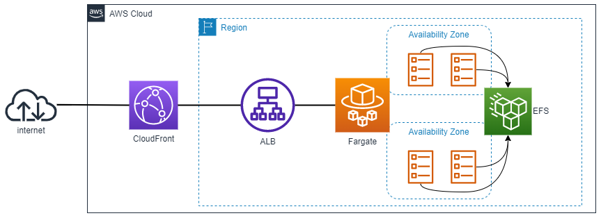
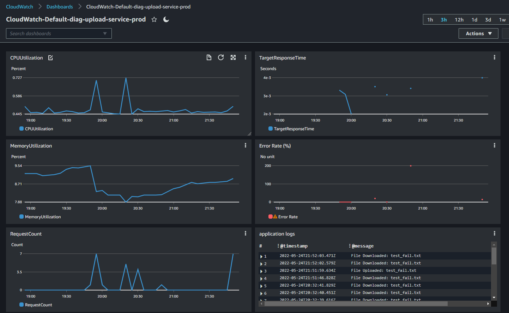
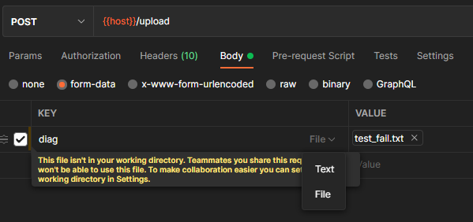

# diag-upload-service

An adorable diagnostic file uploading service. This project is for demonstrative purposes only, don't use this for production. 

## Architecture

## Design Considerations

### Tech

- Deployment - AWS 
- Infrastructure code - Terraform 
- CI/CD - Github Actions 

### A note on the whole serverless thing

The starting point for this project was a containerized solution, so it seemed natural to use AWS fargate as a scalable, highly available solution. It may have been more streamline to use a serverless approach and deploy a solution in lambda, however this requires additional workarounds for dealing with the lambda handler and multiple transformations of the request into something lambda can use seems clunky. As far as scaling goes, this particular MVP does not have autoscaling, but it would be easy enough to add to the ECS service. 

### Auth

There were 2 choices here, the app could have auth baked in, but then you'd have to deal with turning it on and off and it could bloat the code. In the end I opted to consider authentication at the load balancer as albs now offer a range of different ways to authenticate. In a production environment, this would likely be SAML, however, for this exercise I simply created unique header with a simple password. The point is that if you set up a solution with infrastructure code, then none of your microservices have to be developed with auth, speeding up dev times. 

Currently auth is deployed globally on all endpoints, but some type of role-based access is clearly needed. You could also simply block access to the download endpoint at the alb so it can only be accessed internally. 

### Security

I wanted to put a WAF in front of this app. Previous production environments I have used have not been internet facing, and if they were, the AWS accounts we used were already set up with easy ways to implement a WAF. I opted to put Cloudfront in front of the load balancer and create a token header to establish a trust relationship between them. For the sake of time, I used an existing terraform module to create the waf. To further complicate things, a global WAF is needed for fargate, which can only use a us-east-1 provider. This is largely why this is a separate terraform module. . . lesson learned

### Observation and metrics

I opted to use the native AWS tools as much as possible, so I went with a custom CloudWatch dashboard. I didn't go wild with this, but it can be heavily modified. A nice sideeffect of doing this is that the dashboard itself is created with terraform as well. 

### CI/CD

Github Actions is set up to get Authentication and Authorization via OIDC tokens directly via an AWS identity provider, preventing the need to set up an Access keys as secrets in the repo or terraform cloud.

#### Workflows

* **Publish Docker image** - this is unchanged
* **Cleanup Workflow logs** - allows for removing testing actions easily via a workflow dispatch, this is just a utility for this exercise
* **App test and deploy** - When pushes to the main branch happen, this will refresh tasks and update the service itself. I haven't at the time of writing this added unit tests, but presumably you would have unit and integration tests in here as well that would run on pull requests
* **Terraform** - this follows the standard guide for terraform deployments using actions. Plans are run on pull requests and pushes are run on pushes to the main branch. It also puts a comment in pull requests with the plan for easier review of pull requests.

### Time Constraints & More Thoughts

Going into this project I had no experience with javascript or Github Actions. In addition to that, I did not have a personal AWS account, nor have a set up a cloud deployment setup via a windows machine. This took a fair amount of time to set up and establish a new account from scratch. I can ponder some ways of making the service enhancements with only aws services, and I would like to explore the pros and cons of this given more time. Are there ways to make the alb non-sticky? Could you filter the AWSALB cookie with cloudfront and effectively remove the sticky sessions to improve autoscaling? You could likely filter requests to only accept .tgz files, and authentication is mentioned above in detail. 

## Local Testing (the section formerly known as "Run it")

- ensure docker is installed
- `docker build -t diag-upload-service .`
- `docker run -p 8000:8000 diag-upload-service`
- if you have [Postman](https://www.postman.com/), there is a collection in `docs/postman` you can import to test with. From there, you can test various deployments by modifying the `{{host}}` variable 
- There are test files for upload in `docs/postman/testfiles`, of note, the `test_pass.tgz` file simply contains nothing but the test_fail.txt file... cheeky.
- note that you need to change the form data to *file* before you can select the test files   
- ensure that either 1, your files are in the postman working directory, or 2, you have the option set to allow the use of files outside the working directory.

